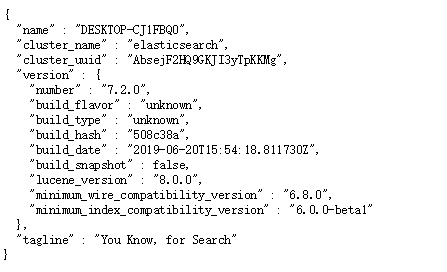
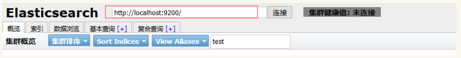

# Kibana和Head使用教程

# windows下

## 一、ElasticSearch 安装教程

ElasticSearch 有安装版和解压缩版，可以根据需要下载。

ElasticSearch 每个大版本改动较大，记得选择自己需要的版本。[官网下载](https://www.elastic.co/downloads/elasticsearch)

* 下载安装版本修改安装地址后，一路next就可以了；下载解压缩版，只需要将文件解压缩到指定的位置就可以。

* 下载完成后，运行程序，点击运行安装版bin目录下ElasticSearch.exe或者解压缩版bin目录下的ElasticSearch.bat文件。

* 进入 http://localhost:9200 查看是否安装成功。



## 二、Head使用教程

### **1.安装head插件**

* 安装GitHub [elasticsearch-head插件](https://github.com/mobz/elasticsearch-head)


### **2.安装Node.js**

* 安装[Node.js](https://nodejs.org/en/download/)，有解压版和安装版，自行选择下载。

* 在命令行控制台中测试，是否安装成功

```
// 查看nodejs是否安装成功 
node -v     
// 查看npm是否安装成功
npm -v      
```

* 安装grunt构建工具

```
// 进入head目录下
cd C:\Users\tzcon\Desktop\es\elasticsearch-head-master          
// grunt是一个很方便的构建工具，可以进行打包压缩、测试、执行等等的工作
npm install -g grunt-cli                                        

npm install
```

* 进入head插件目录下执行 grunt server 命令

```
grunt server
```

* 访问 http://localhost:9100/ ，查看是否安装成功。

[Windows环境下安装ES全文搜素引擎与head插件](https://blog.csdn.net/tzconn/article/details/83016494)

### **3.head插件的使用**

* 启动es和head，浏览器中访问 http://localhost:9100/ ，连接es集群。



* 查看es集群的状态：

  * 绿色，最健康的状态，代表所有的分片包括备份都可用
  * 黄色，基本的分片可用，但是备份不可用（也可能是没有备份）
  * 红色，部分的分片可用，表明分片有一部分损坏。此时执行查询部分数据仍然可以查到，遇到这种情况，还是赶快解决比较好
  * 灰色，未连接到elasticsearch服务

 

* 查看每个索引的概览，通过上图可以看到我们的节点名称为elasticsearch，并且该节点下有两个索引test_index1、test_index2，在test_index2下，选择信息-->索引信息，可以查看该索引的所有信息，包括mappings、setting等等


* 在test_index2下，选择动作-->关闭/开启，可以关闭/开启该索引，关闭后的索引如图：


* 在该界面也可以模糊查询索引、设置刷新频率等操作。如下图:


* 索引：在这里，可以查看到所以的索引，并且还可以创建一个新的索引，如下图：


* 数据浏览：这里可看到索引、类型、字段、数据信息，如下图所示：


[ElasticSearch的基本原理与用法](https://www.cnblogs.com/luxiaoxun/p/4869509.html)

* 基本查询：在这个页签，可以做数据进项简单的查询


[ElasticSearch查询](https://www.cnblogs.com/ljhdo/p/4486978.html)

* 复合查询：在这个页签，可以使用json进行复杂的查询，也可发送put请求新增及跟新索引，使用delete请求删除索引等等。如图所示：


[head插件对elasticsearch 索引文档的增删改查](https://blog.csdn.net/bsh_csn/article/details/53908406)

[elasticsearch-head的使用](https://www.cnblogs.com/xuwenjin/p/8792919.html)

## 三、Kibana使用教程

Kibana 是一个设计出来用于和 Elasticsearch 一起使用的开源的分析与可视化平台，可以用 kibana 搜索、查看、交互存放在Elasticsearch 索引里的数据，使用各种不同的图表、表格、地图等展示高级数据分析与可视化，基于浏览器的接口使你能快速创建和分享实时展现Elasticsearch查询变化的动态仪表盘，让大量数据变得简单，容易理解。

### **1.安装Kibana**

* Kibana依赖node和jdk，需要提前进行安装，[kibana官网下载](https://www.elastic.co/cn/downloads/kibana)。

* 修改配置文件conf/kibana.yml，设置elasticsearch.url为启动的elasticsearch（也可以按照默认方式不进行修改）

```
elasticsearch.url:"http://localhost:9200"
```

* 运行bin/kibana.bat，访问 http://localhost:5601/ 

[Kibana（Windows版本）](https://blog.csdn.net/qq_43147136/article/details/83685446)

[Kibana官网下载](https://www.elastic.co/cn/downloads/past-releases)

### 2. 使用Kibana

这里的kibana是5.6版本的，7版本以后好像加了更多的功能。


#### 2.1 导入测试数据

[从官网下载数据](https://download.elastic.co/demos/kibana/gettingstarted/accounts.zip)，解压到本地文件夹（最好放在除了系统磁盘以外的磁盘）。开启es和kibana，打开命令提示符窗口，进入到解压后文件所在目录。输入命令：

```
// 导入本地es的accounts索引accounts_doc类型
curl -H "Content-Type: application/x-ndjson" -XPOST "localhost:9200/accounts/accounts_doc/_bulk?pretty" --data-binary @accounts.json
```


运行后看见控制台在动，没有报error错就是导入成功。

#### 2.2 使用管理视图管理索引


输入对应的索引名 accounts 或者使用通配符 account* 都可以将索引加入管理，管理后的索引就可以使用Discover 功能进行数据的查看


[导入官网测试数据](https://blog.csdn.net/u012224510/article/details/86571305)

#### 2.3 开发者命令

一般kibana最常用的就是Dev Tools 功能，不过需要对es的基本命令熟悉才能进行操作（其他的几个功能面板目前我也没有怎么接触过）。


## 参考

[Kibana使用介绍](https://www.cnblogs.com/wtzbk/p/10251546.html)


